[TOC]

# 1. 背景

人脸表情识别（facialexpression recognition, FER）作为人脸识别技术中的一个重要组成部分，近年来在人机交互、安全、机器人制造、自动化、医疗、通信和驾驶领域得到了广泛的关注，成为学术界和工业界的研究热点。本项目将通过深度学习技术来对人脸识别中的表情识别展开。

# 2.代码使用与说明

## 2.1 环境搭建

本实验再anaconda的基础上运行，显卡为RTX3070。在`Anaconda prompt`中输入如下命令：

```python
conda create -n face_expression python=3.9 # 创建conda虚拟环境 
conda activate face_expression# 激活环境
conda install cudatoolkit=11.2 # 根据NVIDIA的版本而定
conda install cudnn=8.2.0 # 需要与cudatoolkit版本对应
pip install -r requirements.txt# 安装代码依赖库 
```

需要注意的是，`dlib`库需要手动安装，在代码中的命名为`dlib-19.23.0-cp39-cp39-win_amd64.whl`，命令如下：

```python
pip install dlib-19.23.0-cp39-cp39-win_amd64.whl
```

## 2.2代码说明

- assets：表情对应的icon、中文字体
- dataset：实验用测试的三组数据集ck+、fer2013、jaffe
- input：测试图片及视频
- models：训练好的模型权重.h5文件
- requirements.txt：代码依赖库
- dlib-19.23.0-cp39-cp39-win_amd64.whl：需要手动安装的库
- src：主体源码
  - blazeface：谷歌开源的人脸检测代码
  - ui：UI设计
  - data.py：读入数据集模块
  - gui.py：运行UI界面的脚本
  - model：构建的CNN（3个）模块
  - recognition.py：表情预测处理模块
  - recognition_camera.py：运行摄像头实时检测的脚本
  - train.py：模型训练脚本
  - utils.py：工具库
  - visualize.py：可视化训练过程、特征图

# 3. 数据集介绍

项目先后在3个有代表性的数据集Jaffe、CK+、FER2013展开了实验。**为了提高模型训练效率，我们对这3个数据集的所有图片缩放到`48x48`像素**，现分别对这3个数据集进行介绍：

- Jaffe[1]：**JAFFE**数据集由来自10个不同日本女性受试者的不同面部表情的213张图像组成。每个受试者被要求做7个面部表情（6个基本面部表情和中性表情），包括anger、disgust、fear、happy、neutral、sad、surprised，最后由60个注释者对每个面部表情进行平均语义评分。
- CK+[2]：扩展Cohn-Kanade（**CK+**），是实验室中使用最广泛的数据集。包含来自123个不同主题的593个视频序列，年龄从18岁到50岁不等。每个视频都显示了从中性表情到目标峰值表情的面部转变，以每秒30帧（FPS）的速度录制，分辨率为 640x490 或 640x480 像素，共计有327个标记图片，包含愤怒，蔑视，厌恶，恐惧，快乐，悲伤和惊讶的面部表情分。
- FER2013[3]：Fer2013包含大约30000张不同表情的面部RGB图像，大小限制为48×48，其主要标签可分为7种类型：0=愤怒，1=厌恶，2=恐惧，3=快乐，4=悲伤，5=惊喜，6=中性，是目前最具挑战性的数据集之一。

此外，需要注意的是Jaffe和CK+并没有划分训练集、验证集与测试集，考虑到数据量较小的问题，我们以8:2的方式划分成训练集与验证集，以验证集的精度作为模型评估结果。

# 4. 模型架构设计

为了方便训练与模型架构的选取，我们首先选择了较小的数据集`jaffe`对模型进行评估，并将batch_size适当的调小为4，epoch为300。模型训练的过程代码如下：

```python
python src/train.py --dataset jaffe --epochs 300 --batch_size 4
```

我们依据三篇顶会论文，设计了三种卷积神经网络（Convolutional Neural Network, CNN）的架构，并综合三者得到了效果最好的模型架构。

## 4.1 VGG-based

### 4.1.1 设计思路

CNN的模型架构首先参考论文**Very deep convolutional networks for large-scale image recognition**[4]的设计思路，如下图所示。该网络的特点有两个：

- 全部采用3x3的卷积核。
- 层数越深，卷积核数量越多。


### 4.1.2 具体实现

具体来说，我们设计的网络架构由**3个block层和3个全连接层**组成，特点如下：

- 每一个block由两个的卷积层（3x3，黄色）、一个最大池化层（2x2，红色）组成。
- 随着层数增加，卷积核的数量**呈二次方增长**（32->64->128）。
- 除了最后一个全连接层的激活函数选用softmax用于多分类，其它层后均通过relu函数作为非线性变换。

-1.png)

> 图片Latex代码：https://www.overleaf.com/project/637ee654f12f4d5309d9874e

tensorflow代码实现如下：

```python
def CNN1(input_shape=(48, 48, 1), n_classes=8):
    """
    :param input_shape: 输入图片的尺寸
    :param n_classes: 目标类别数目
    :return: model
    """
    # input
    input_layer = Input(shape=input_shape)
    # block1
    x = Conv2D(32, kernel_size=(3, 3), strides=1, padding='same', activation='relu')(input_layer)
    x = Conv2D(32, kernel_size=(3, 3), strides=1, padding='same', activation='relu')(x)
    x = MaxPooling2D(pool_size=(2, 2), strides=(2, 2))(x)
    x = Dropout(0.5)(x)
    # block2
    x = Conv2D(64, kernel_size=(3, 3), strides=1, padding='same', activation='relu')(x)
    x = Conv2D(64, kernel_size=(3, 3), strides=1, padding='same', activation='relu')(x)
    x = MaxPooling2D(pool_size=(2, 2), strides=(2, 2))(x)
    x = Dropout(0.5)(x)
    # block3
    x = Conv2D(128, kernel_size=(3, 3), strides=1, padding='same', activation='relu')(x)
    x = Conv2D(128, kernel_size=(3, 3), strides=1, padding='same', activation='relu')(x)
    x = MaxPooling2D(pool_size=(2, 2), strides=(2, 2))(x)
    x = Dropout(0.5)(x)
    # fc
    x = Flatten()(x)
    x = Dense(1024, activation='relu')(x)
    x = Dropout(0.5)(x)
    x = Dense(128, activation='relu')(x)
    output_layer = Dense(n_classes, activation='softmax')(x)

    model = Model(inputs=input_layer, outputs=output_layer)
    return model
```

在Jaffe数据集上的训练结果如下图，其中，在验证集（validation set）上模型的最佳精度为`87.5%`。

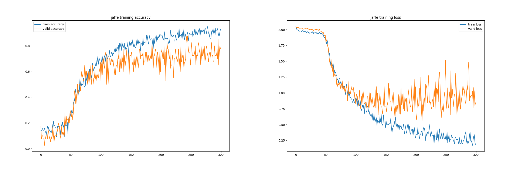

## 4.2 GoogLeNet-based

### 4.2.1 设计思路

接着，我们参考论文**Going deeper with convolutions**[5]的设计思路，其整体架构的卷积核设计如下图所示。该网络的主要特点如下：

- 设计不同尺寸的卷积核，包括1x1、3x3、5x5，来**多尺度**处理图像。

- 从(a)->(b)图，作者在3x3和5x5的卷积核前使用了1x1的卷积核，能够有效的**降维**并**增加非线性**。


### 4.2.2 具体实现

具体来说，我们对3.1的模型做了如下修改：

- 将纯粹的3x3卷积核替换为由3x3、5x5组成的多尺度卷积核。
- 在5x5卷积核之前使用1x1卷积核来对输入图像降维和非线性化表示。

-1.png)

tensorflow代码实现如下：

```python
def CNN2(input_shape=(48, 48, 1), n_classes=8):
    """
    :param input_shape:
    :param n_classes:
    :return:model
    """
    # input
    input_layer = Input(shape=input_shape)
    # block1
    x = Conv2D(32, (1, 1), strides=1, padding='same', activation='relu')(input_layer)
    x = Conv2D(32, (5, 5), strides=1, padding='same', activation='relu')(x)
    x = MaxPooling2D(pool_size=(2, 2), strides=2)(x)
    # block2
    x = Conv2D(32, (3, 3), padding='same', activation='relu')(x)
    x = MaxPooling2D(pool_size=(2, 2), strides=2)(x)
    # block3
    x = Conv2D(64, (5, 5), padding='same', activation='relu')(x)
    x = MaxPooling2D(pool_size=(2, 2), strides=2)(x)
    # fc
    x = Flatten()(x)
    x = Dense(2048, activation='relu')(x)
    x = Dropout(0.5)(x)
    x = Dense(1024, activation='relu')(x)
    x = Dropout(0.5)(x)
    x = Dense(n_classes, activation='softmax')(x)

    model = Model(inputs=input_layer, outputs=x)
    return model
```

同样，在Jaffe数据集上的训练结果如下图，在验证集（validation set）上模型最佳精度为`95.0%`，说明第二种模型设计更合理。


## 4.3 2018CVPR-based

### 4.3.1 设计思路

最后，我们参考2018年发表在CVPR上的论文**A Compact Deep Learning Model for Robust Facial Expression Recognition**[6]的设计思路，其整体架构图如下。该网络的主要特点如下：

- 除了用于多分类的激活函数softmax，CNN架构均采用PReLU作为激活函数。
- 每个block的卷积核个数保持不变，为64。


### 4.3.2 具体实现

具体来说，我们将3.1和3.2的模型与上述论文思路进行了综合，形成最终的模型架构。修改细节如下：

- 结合模型1的"2卷积1池化"和模型2的"多尺度卷积"。
- 依据论文3，将block的层数降低为2，并且每个block的卷积核个数保持64不变。
- 将原来卷积层和池化层的激活函数ReLU替换为PReLU。

-1.png)

```python
def CNN3(input_shape=(48, 48, 1), n_classes=8):
    """
    :param input_shape:
    :param n_classes:
    :return:model
    """
    # input
    input_layer = Input(shape=input_shape)
    x = Conv2D(32, (1, 1), strides=1, padding='same', activation='relu')(input_layer)
    # block1
    x = Conv2D(64, (3, 3), strides=1, padding='same')(x)
    x = PReLU()(x)
    x = Conv2D(64, (5, 5), strides=1, padding='same')(x)
    x = PReLU()(x)

    x = MaxPooling2D(pool_size=(2, 2), strides=2)(x)
    # block2
    x = Conv2D(64, (3, 3), strides=1, padding='same')(x)
    x = PReLU()(x)
    x = Conv2D(64, (5, 5), strides=1, padding='same')(x)
    x = PReLU()(x)
    x = MaxPooling2D(pool_size=(2, 2), strides=2)(x)
    # fc
    x = Flatten()(x)
    x = Dense(2048, activation='relu')(x)
    x = Dropout(0.5)(x)
    # x = Dense(1024, activation='relu',kernel_regularizer=regularizers.l2(0.01),
    #             activity_regularizer=regularizers.l1(0.01))(x)
    x = Dense(1024, activation='relu')(x)
    x = Dropout(0.5)(x)
    x = Dense(n_classes, activation='softmax')(x)

    model = Model(inputs=input_layer, outputs=x)
    return model
```

最终，在Jaffe数据集上所划分的验证集（validation set）上模型最佳精度达到`97.5%`，确定`CNN3`为最终的模型结构。


# 5. 模型训练策略

我们用最终设计的CNN3模型在CK+以及fer2013进行训练以及测试，

- 对于CK+数据集，运行脚本如下：

```python
python src/train.py --dataset ck+ --epochs 300 --batch_size 4
```


模型效果很好，accuracy在之后的epoch几乎都是99%左右浮动。

- 对于fer2013数据集，考虑到数据集较大，我们将batch_size调整至16，运行脚本如下：

```python
python src/train.py --dataset fer2013 --epochs 300 --batch_size 16
```


模型在100epoch之后，训练集loss不断降低、验证集loss不断升高，是**很明显的过拟合现象**，因此我们有必要对fer2013进行额外的设计，包括early stop、batch normlization、skip conncetion等尝试。

### 5.1 早停与学习率优化

ReduceLROnPlateau与EarlyStopping通常是设计在一起配合使用的，但此次实验搭配两者的效果却不尽人意。**为此我们对两者进行了消融实验，得出ReduceLROnPlateau有时会损害模型性能的结论。**

首先介绍ReduceLROnPlateau与EarlyStopping的概念：

- EarlyStopping：当达到当训练集上的loss不再减小（即减小的程度小于某个阈值）的时候停止训练。其中`patience`指容忍的epoch，此处我们设为50。
- ReduceLROnPlateau：当标准评估停止提升时，降低学习速率。当其中的`patience`（设为20）比EarlyStopping的`patience`小时才会有更好的效果。

接着，`Callbacks`中有一些设置好的接口，可以直接使用，具体代码如下

```python
EarlyStopping(monitor='val_loss', patience=50, verbose=True),
ReduceLROnPlateau(monitor='lr', factor=0.1, patience=20, verbose=True),
```

最后的消融实验结果表明，仅仅使用早停策略的epoch更短，并且精度也更相差甚微，因此ReduceLROnPlateau和EarlyStopping搭配并不总是好的，具体数据如下：

| 策略                                  | 测试集精度 | epoch   |
| ------------------------------------- | ---------- | ------- |
| no EarlyStopping+no ReduceLROnPlateau | **0.685**  | 300     |
| only EarlyStopping                    | 0.682      | **107** |
| only ReduceLROnPlateau                | 0.622      | 300     |
| EarlyStopping+ReduceLROnPlateau       | 0.620      | 128     |

### 5.2 Dropout

Dropout是常用的模型泛化策略，考虑到全连接层参数量过大容易导致过拟合，因此在第一个全连接层和第二个全连接层分别加入50%的Dropout用以提升模型性能。


```python
x = Dense(2048, activation='relu')(x)
x = Dropout(0.5)(x)
x = Dense(1024, activation='relu')(x)
x = Dropout(0.5)(x)
```

### 5.3 Batch Normalization

BN能够缓解神经网络难以训练的问题，具有以下特点：

- BN使得网络中每层输入数据的分布相对稳定，加速模型学习速度。
- BN使得模型对网络中的参数不那么敏感，简化调参过程，使得网络学习更加稳定。
- BN具有一定的正则化效果。

为此，我们在每个池化层之前加入Batch Normalization，如下图所示：


实现代码如下：

```python
x = BatchNormalization()(x)
```

实验结果表明，使用batchnormalization每个epoch所使用的时间更少，精度更高，具体如下表：

| 策略                   | 测试集精度 | 一个epoch时间 | 总时间      |
| ---------------------- | ---------- | ------------- | ----------- |
| no Batch Normalization | 0.685      | 约27s         | 约2.25h     |
| Batch Normalization    | **0.693**  | **约25s**     | **约2.08h** |

# 6.实验结果

从网络架构的11个层（从输入到输出）的人脸可视化结果可以看出，从浅层到深层的人脸的轮廓逐渐模糊，直到最后形成无法理解的斑点图。


此外，我们的测试集精度`0.69322`，领先于`0.69267`，处于Kaggle比赛[7]中第二名的成绩。


# 7. 模型应用

在模型应用时，我们发现**实际图片与训练集上的图片是有很大的区别**。

- 训练图片仅包括人脸，而实际图片往往同时包括人脸和上半身。
- 相较于训练图片，实际图片并不”标准“，往往会有噪声。

解决思路如下：

- 用7.1节介绍**人脸检测器blazeface[8]**来检测人脸来提取图片中的人脸。
- 用7.2节介绍的**推理数据增强**策略保证实际图片推理精度。

此外，为了方便组员使用，我们为该模型开发了基于PyQt5的GUI界面（7.3节）、基于OpenCV摄像头实时检测（7.4节），将图片推广到视频。

## 7.1 blazeface

BlazeFace是谷歌研究院的一款快速、轻便的人脸检测器。在本项目中，输入图片`img`，将返回  (x1, y1, w, h) 形式的多张（如有）人脸。在本项目中的调用代码如下：

> 其中 (x1, y1)对应的是**预测目标框的几何中心坐标**， (w, h)对应的是预测目标框的宽度与高度。

```python
from blazeface import blaze_detect
faces = blaze_detect(img)
```

## 7.2 数据推理增强

数据推理增强主要是在预测时对一张图片进行`水平翻转`、`平移`等增广得到**多个概率分布**，再将这些概率分布进行加权求和，得到最后的概率分布，概率最大的作为标签。代码实现细节如下：

1. 首先对预测图片`face_img`进行增广：

```python
resized_images = list()
resized_images.append(face_img[:, :])
resized_images.append(face_img[2:45, :])# 平移
resized_images.append(cv2.flip(face_img[:, :], 1))# 水平翻转
resized_images.append(face_img[0:45, 0:45])
resized_images.append(face_img[2:47, 0:45])
resized_images.append(face_img[2:47, 2:47])
```

例如：

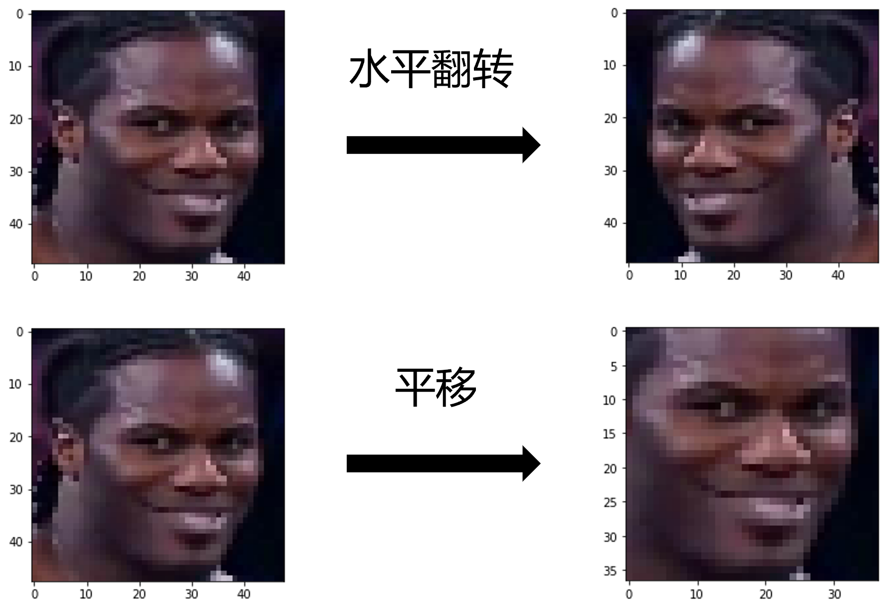


2. 对预测图片及其增广图片的结果加权求和，最大的概率为对应的表情：

```python
results = model.predict(faces_img_gray)
result_sum = np.sum(results, axis=0).reshape(-1)
label_index = np.argmax(result_sum, axis=0)
```

## 7.3 UI界面

UI界面的基本运行逻辑可由如下流程图表示：

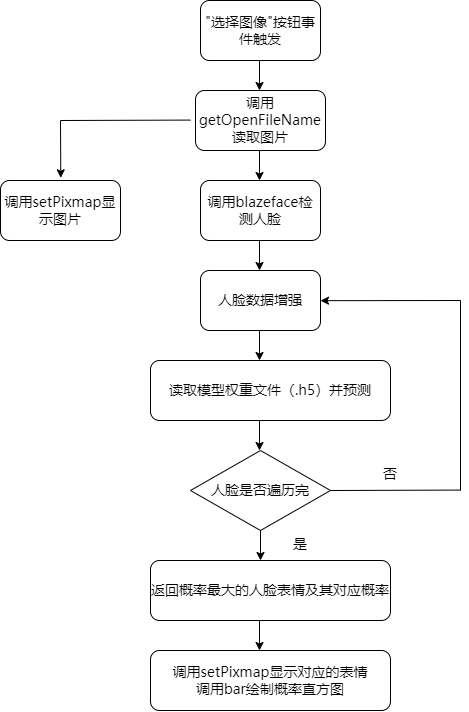


运行如下脚本即可打开交互界面：

```python
python src/gui.py
```

基于PyQt5的UI界面，包含原始图像现实区域，选择图像按钮、识别表情类别及其对应的概率直方图，如下：

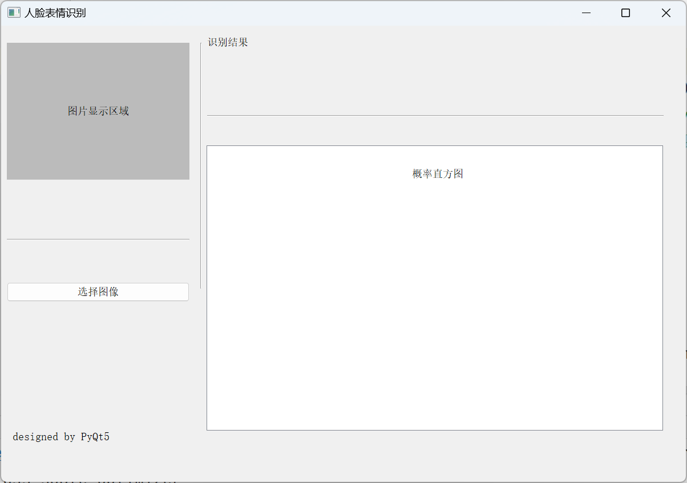

演示Demo如下：

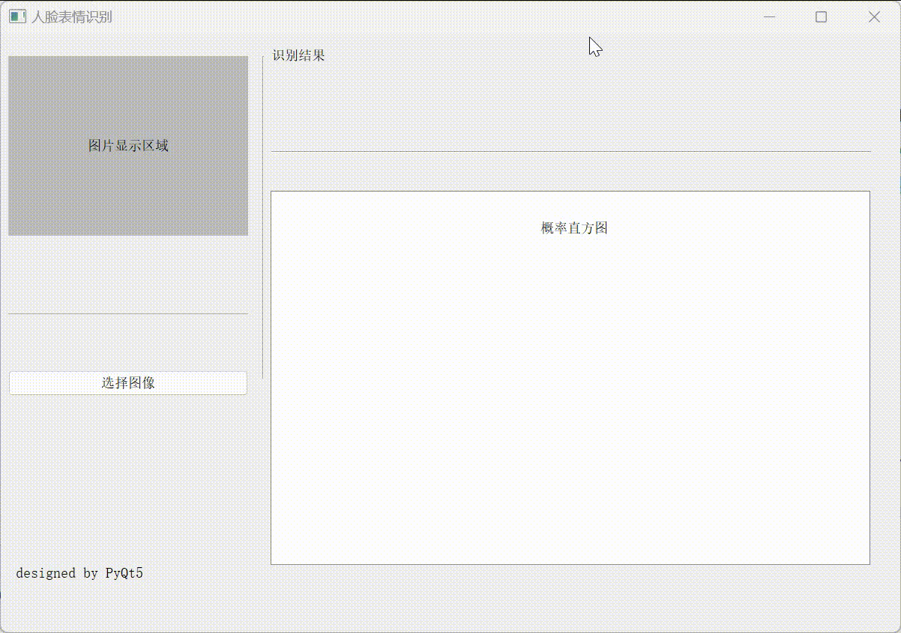

对于常规图片的anger、neutral、sad、happy、fear、surprised的测试结果如下：

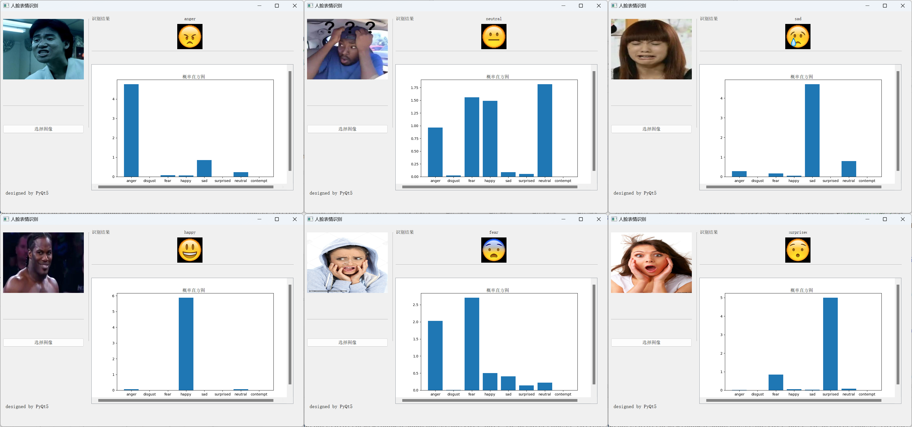

对于人脸模糊（左图）、卡通头像（中图）、多人脸（右图）等特殊场景的鲁棒性测试如下：

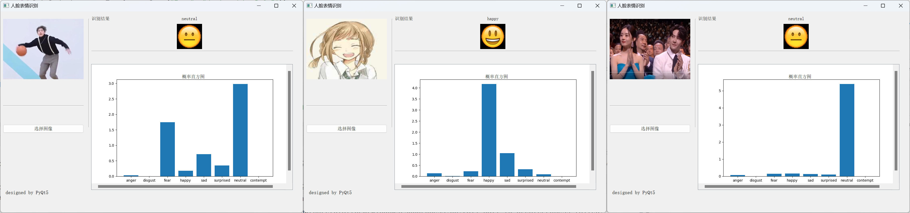

当图片中存在多张人脸时，在UI界面下预测只显示**最可能是人脸（概率最大）**的那个脸表情，但是对所有检测到的人脸都会框定预测结果并在图片上标记，标记后的图片在`output`目录下。例如针对上图，模型得到的不同人脸的表情如下：

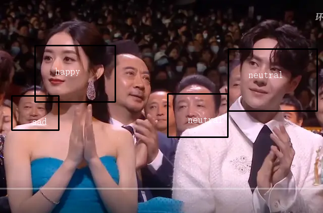

由于右边男性为人脸的概率最大，**因此UI界面以他的表情`neutral`作为输出，但实际上可以识别多个人脸的表情**。

## 7.4 摄像头实时检测

摄像头实时检测界面的基本运行逻辑可由如下流程图表示：

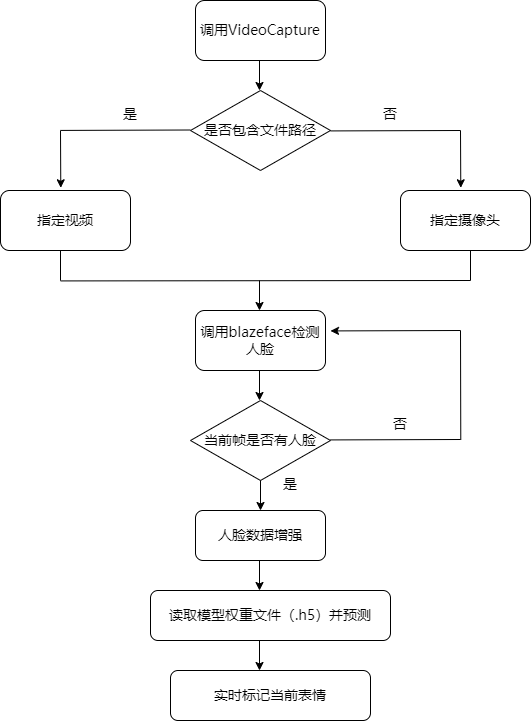

运行如下脚本，来对视频中的人脸进行表情识别：

```python
python src/recognition_camera.py --source 1 --video_path D:/PycharmProjects/DL/input/vedio/test7.mp4
```


运行如下脚本，对摄像头中的人脸进行表情分析：

```python
python src/recognition_camera.py
```


# 8. 反思与总结

## 8.1 项目总结

- 在模型设计阶段，通过综合三篇论文的思想，我们设计出一种新颖的CNN结构，其特点包括`多尺度卷积`、`卷积核数目保持恒定`、`使用PReLU作为激活函数`，实验表明这种结构在面部表情识别任务上能够达到更好的效果。
- 在模型训练阶段，我们加入`早停`、`Dropout`和`Batch Normalization`三种训练策略均能够有效提升模型的性能。通过对ReduceLROnPlateau和EarlyStopping进行消融实验，得出ReduceLROnPlateau有时会损害模型性能的结论。
- 在实验结果阶段，我们对CNN结构的特征图进行可视化，提升了一定的模型可解释性。并且测试集精度以`0.69322`超越fer2013 Kaggle比赛中的第二名。
- 在模型应用阶段，我们通过`blazeface人脸检测`与`数据推理增强`来解决实际图片面临的问题，并实现`GUI`界面和`摄像头实时检测`来拓宽模型的应用面。

## 8.2 反思

1. 在模型设计中，`PRelu`[9]为什么比`ReLU`的效果好？

   从函数图像和数学表达式理解（左为ReLU，右为PReLU），简而言之，对于每一个通道，负方向都有一个可学习参数来控制斜率。

   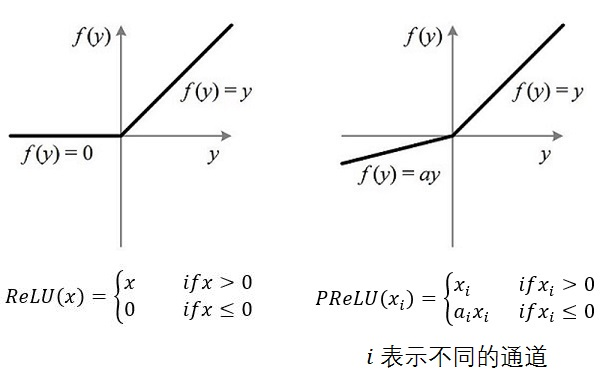

   对于这个可学习参数，反向传播的梯度学习如下式：

   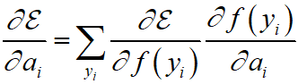

2. 在模型训练阶段，ReduceLROnPlateau为什么会失效？

   ReduceLROnPlateau的设计预想是经过一定epoch迭代之后，模型效果不再提升，就需要通过学习率的降低来提升模型。这样做虽然能够避免在极小值的附近来回跳跃的情况，但学习率一味的减少会导致该点无法跳出局部最优解，这可能是ReduceLROnPlateau失效的原因之一。

3. 在模型测试阶段，为什么6张图片`disgust`的标签预测概率几乎全部为0？

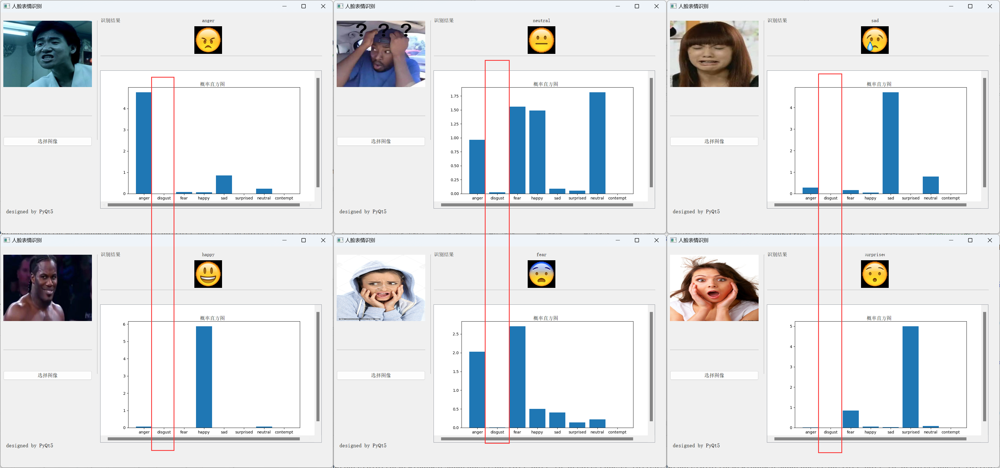	一方面，在fer2013中用于训练的图像的数量分布如下：

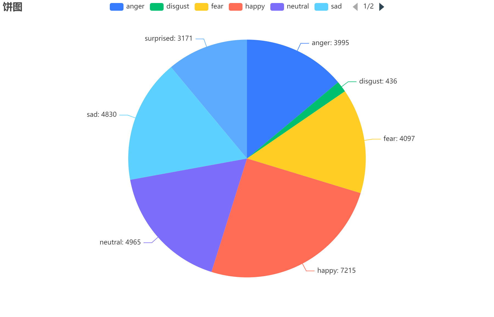

​	disgust仅仅只有436张，模型很难通过数据训练去学习到这类表情的特点。另一方面，disgust本身的表情也具有很高的复杂性，并且	常常和anger等表情特征有所重叠，也就导致了disgust收集和标注的困难性。

# 参考文献

[1] Michael J. Lyons, Shigeru Akemastu, Miyuki Kamachi, Jiro Gyoba. Coding Facial Expressions with Gabor Wavelets, 3rd IEEE International Conference on Automatic Face and Gesture Recognition, pp. 200-205 (1998).

[2] Lucey P, Cohn J F, Kanade T, et al. The extended cohn-kanade dataset (ck+): A complete dataset for action unit and emotion-specified expression[C]//2010 ieee computer society conference on computer vision and pattern recognition-workshops. IEEE, 2010: 94-101.

[3] Goodfellow I J, Erhan D, Carrier P L, et al. Challenges in representation learning: A report on three machine learning contests[C]//International conference on neural information processing. Springer, Berlin, Heidelberg, 2013: 117-124.

[4] Simonyan K, Zisserman A. Very deep convolutional networks for large-scale image recognition[J]. arXiv preprint arXiv:1409.1556, 2014.

[5] Szegedy C, Liu W, Jia Y, et al. Going deeper with convolutions[C]//Proceedings of the IEEE conference on computer vision and pattern recognition. 2015: 1-9.

[6] Kuo C M, Lai S H, Sarkis M. A compact deep learning model for robust facial expression recognition[C]//Proceedings of the IEEE conference on computer vision and pattern recognition workshops. 2018: 2121-2129.

[7] [Challenges in Representation Learning: Facial Expression Recognition Challenge | Kaggle](https://www.kaggle.com/competitions/challenges-in-representation-learning-facial-expression-recognition-challenge/leaderboard) 

[8] [ibaiGorordo/BlazeFace-TFLite-Inference: Python scripts to detect faces in Python with the BlazeFace Tensorflow Lite models (github.com)](https://github.com/ibaiGorordo/BlazeFace-TFLite-Inference)

[9] He K, Zhang X, Ren S, et al. Delving deep into rectifiers: Surpassing human-level performance on imagenet classification[C]//Proceedings of the IEEE international conference on computer vision. 2015: 1026-1034.

[10] https://github.com/WuJie1010/Facial-Expression-Recognition.Pytorch